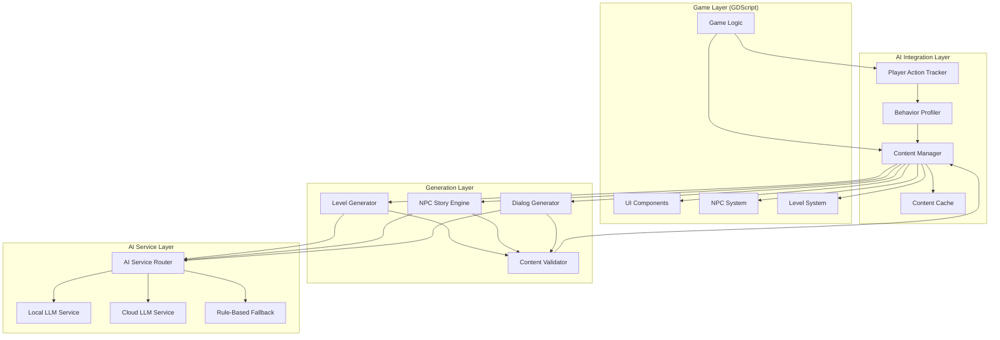
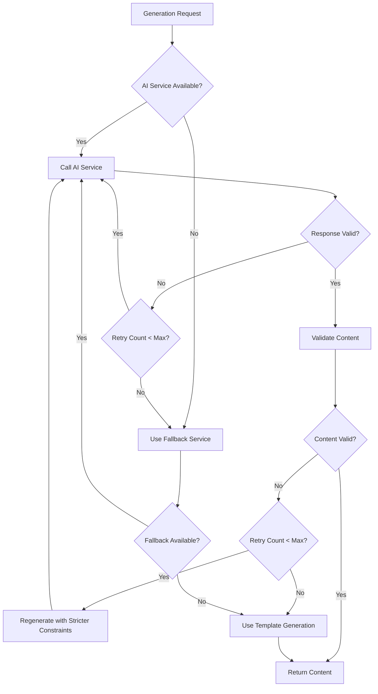

# Design Document: AI-Integrated Dynamic Gameplay System

## Overview

This design describes an AI-powered content generation system for a 2D pixelated Godot game that creates unique, personalized gameplay experiences. The system tracks player behavior, analyzes play patterns, and uses AI (local or cloud-based LLMs) to dynamically generate levels, NPCs, dialogs, and other game content that adapts to each player's style.

The architecture prioritizes performance for low-spec hardware through aggressive caching, background processing, and fallback mechanisms. All AI generation happens asynchronously to avoid blocking gameplay, with placeholder content displayed until generation completes.

**Key Design Principles:**
- **Non-blocking**: All AI operations run on background threads using Godot's Thread API
- **Graceful degradation**: System falls back to rule-based generation when AI is unavailable
- **Performance-first**: Strict time budgets with caching and pre-generation strategies
- **Seamless integration**: Works with existing Godot systems (inventory, quests, combat, UI)

## Architecture

### High-Level Component Diagram



### Threading Model

The system uses Godot's Thread API to perform AI generation without blocking the main game loop:

1. **Main Thread**: Handles game logic, rendering, input, and UI updates
2. **Generation Threads**: Pool of worker threads for AI content generation
3. **Communication**: Thread-safe queues for requests/responses, with `call_deferred()` for scene tree updates

**Thread Safety Rules:**
- Scene tree modifications only on main thread via `call_deferred()`
- Shared data structures protected by mutexes
- Generated content validated before adding to scene tree
- Signals emitted on main thread for generation completion

## Components and Interfaces

### 1. Player Action Tracker

**Purpose**: Monitors and records player actions to build a behavioral history.

**GDScript Interface**:
```gdscript
class_name PlayerActionTracker
extends Node

# Record player actions
func record_combat_action(action_type: String, target: Node, outcome: String) -> void
func record_dialog_choice(npc_id: String, choice_text: String, choice_category: String) -> void
func record_exploration_event(event_type: String, location: Vector2, context: Dictionary) -> void
func record_npc_interaction(npc_id: String, interaction_type: String, outcome: String) -> void
func record_quest_completion(quest_id: String, choices: Array, outcome: String) -> void

# Query action history
func get_recent_actions(count: int = 100) -> Array[Dictionary]
func get_actions_by_type(action_type: String) -> Array[Dictionary]

# Persistence
func save_to_disk() -> Error
func load_from_disk() -> Error

# Signals
signal action_recorded(action: Dictionary)
signal history_saved()
```

**Data Structure**:
```gdscript
# Action record format
{
    "timestamp": float,  # Unix timestamp
    "type": String,      # "combat", "dialog", "exploration", "interaction", "quest"
    "category": String,  # Specific subcategory
    "context": Dictionary,  # Action-specific data
    "outcome": String    # Result of the action
}
```

**Implementation Notes**:
- Maintains a circular buffer of 100 most recent actions in memory
- Persists full history to disk using JSON serialization
- Uses a decay function: recent actions weighted higher than old ones
- Auto-saves every 60 seconds and on scene transitions

### 2. Behavior Profiler

**Purpose**: Analyzes player action history to compute a behavioral profile.

**GDScript Interface**:
```gdscript
class_name BehaviorProfiler
extends Node

# Profile computation
func compute_profile(actions: Array[Dictionary]) -> BehaviorProfile
func update_profile_incremental(new_action: Dictionary) -> void

# Profile queries
func get_current_profile() -> BehaviorProfile
func get_dominant_playstyle() -> String  # Returns "combat", "exploration", "story", "balanced"

# Configuration
func set_decay_rate(rate: float) -> void  # How quickly old actions lose weight
func set_minimum_actions(count: int) -> void  # Minimum actions before profile is valid

# Signals
signal profile_updated(profile: BehaviorProfile)
```

**Behavior Profile Data Structure**:
```gdscript
class_name BehaviorProfile
extends Resource

# Combat preferences (0.0 to 1.0)
var combat_aggressive: float = 0.5
var combat_defensive: float = 0.5
var combat_stealth: float = 0.5
var combat_magic: float = 0.5

# Dialog preferences (0.0 to 1.0)
var dialog_aggressive: float = 0.5
var dialog_diplomatic: float = 0.5
var dialog_curious: float = 0.5
var dialog_deceptive: float = 0.5

# Exploration preferences (0.0 to 1.0)
var exploration_thorough: float = 0.5
var exploration_speedrun: float = 0.5
var exploration_treasure: float = 0.5
var exploration_story: float = 0.5

# Interaction preferences (0.0 to 1.0)
var interaction_helpful: float = 0.5
var interaction_hostile: float = 0.5
var interaction_neutral: float = 0.5
var interaction_transactional: float = 0.5

# Difficulty preference
var preferred_difficulty: float = 0.5  # 0.0 = easy, 1.0 = hard

# Metadata
var total_actions_analyzed: int = 0
var last_updated: float = 0.0  # Unix timestamp
var is_valid: bool = false  # True when enough data exists

func to_dict() -> Dictionary
func from_dict(data: Dictionary) -> void
```

**Profile Computation Algorithm**:
1. Initialize all weights to 0.5 (neutral)
2. For each action in history:
   - Calculate time decay: `weight = exp(-decay_rate * age_in_seconds)`
   - Update relevant category weights based on action type
   - Normalize weights to [0.0, 1.0] range
3. Mark profile as valid if `total_actions_analyzed >= minimum_actions`

### 3. Content Manager

**Purpose**: Central coordinator for all AI content generation requests.

**GDScript Interface**:
```gdscript
class_name ContentManager
extends Node

# Generation requests (async)
func request_level_generation(context: GenerationContext) -> int  # Returns request_id
func request_npc_generation(context: GenerationContext) -> int
func request_dialog_generation(npc_id: String, context: GenerationContext) -> int

# Request status
func is_request_complete(request_id: int) -> bool
func get_request_result(request_id: int) -> Variant  # Returns generated content or null
func cancel_request(request_id: int) -> void

# Cache management
func get_cached_content(cache_key: String) -> Variant
func cache_content(cache_key: String, content: Variant, ttl_seconds: float) -> void
func clear_cache() -> void
func get_cache_stats() -> Dictionary  # Returns hit rate, size, etc.

# Configuration
func set_performance_budget(operation_type: String, max_ms: float) -> void
func set_ai_provider(provider: String) -> void  # "local", "openai", "anthropic"
func enable_offline_mode(enabled: bool) -> void

# Signals
signal generation_complete(request_id: int, content: Variant)
signal generation_failed(request_id: int, error: String)
signal cache_hit(cache_key: String)
```

**Generation Context**:
```gdscript
class_name GenerationContext
extends Resource

var behavior_profile: BehaviorProfile
var player_level: int
var story_progress: Dictionary  # Current story state
var world_state: Dictionary  # Current world state
var previous_content: Array  # Recently generated content to avoid repetition
var constraints: Dictionary  # Generation-specific constraints
var urgency: String  # "immediate", "normal", "background"
```

**Request Queue Management**:
- Three priority queues: immediate (dialog), normal (NPCs), background (levels)
- Worker thread pool (size configurable, default 2 threads)
- Timeout enforcement based on performance budgets
- Automatic fallback to cache or rule-based generation on timeout

### 4. Level Generator

**Purpose**: Generates dynamic level layouts influenced by player behavior.

**GDScript Interface**:
```gdscript
class_name LevelGenerator
extends Node

# Main generation function
func generate_level(profile: BehaviorProfile, context: GenerationContext) -> LevelData

# Integration with existing procedural generation
func apply_ai_modifications(base_level: LevelData, profile: BehaviorProfile) -> LevelData

# Validation
func validate_level(level: LevelData) -> bool  # Checks playability, paths, balance

# Configuration
func set_generation_mode(mode: String) -> void  # "full_ai", "hybrid", "rule_based"
```

**Level Data Structure**:
```gdscript
class_name LevelData
extends Resource

var layout: Array[Array]  # 2D grid of tile types
var enemy_spawns: Array[EnemySpawn]
var item_spawns: Array[ItemSpawn]
var npc_spawns: Array[NPCSpawn]
var secret_areas: Array[SecretArea]
var objectives: Array[Objective]
var difficulty_rating: float
var estimated_completion_time: float

class EnemySpawn:
    var position: Vector2
    var enemy_type: String
    var difficulty_modifier: float

class ItemSpawn:
    var position: Vector2
    var item_type: String
    var rarity: String

class NPCSpawn:
    var position: Vector2
    var npc_id: String
    var npc_data: NPCData

class SecretArea:
    var bounds: Rect2
    var reward_type: String

class Objective:
    var type: String  # "reach", "defeat", "collect", "interact"
    var target: Variant
    var optional: bool
```

**Generation Strategy**:
1. **Base Generation**: Use existing procedural map generation for layout
2. **AI Enhancement**: Query LLM for behavior-specific modifications:
   - Combat-focused: Increase enemy density, add tactical positions
   - Exploration-focused: Add secret areas, branching paths
   - Story-focused: Add NPC encounters, environmental storytelling
3. **Validation**: Ensure level is playable (valid paths, balanced difficulty)
4. **Fallback**: If AI fails or times out, use rule-based modifications

**AI Prompt Template**:
```
You are a level designer for a 2D pixelated game. Generate modifications to enhance a level for a player with this profile:
- Combat style: {combat_weights}
- Exploration style: {exploration_weights}
- Preferred difficulty: {difficulty}

Base level has {enemy_count} enemies, {item_count} items, {secret_count} secrets.

Provide JSON output:
{
  "enemy_density_modifier": float (0.5 to 2.0),
  "secret_area_count": int,
  "npc_encounter_count": int,
  "difficulty_adjustment": float (-0.2 to 0.2),
  "special_features": [string array]
}
```

### 5. NPC Story Engine

**Purpose**: Generates unique NPC personalities, backstories, and motivations.

**GDScript Interface**:
```gdscript
class_name NPCStoryEngine
extends Node

# NPC generation
func generate_npc(profile: BehaviorProfile, context: GenerationContext) -> NPCData

# Story integration
func generate_quest_hooks(npc: NPCData, player_history: Array) -> Array[QuestHook]

# Validation
func validate_npc(npc: NPCData) -> bool  # Checks consistency, lore compatibility
```

**NPC Data Structure**:
```gdscript
class_name NPCData
extends Resource

var npc_id: String
var name: String
var personality_traits: Array[String]  # e.g., ["cautious", "greedy", "loyal"]
var backstory: String
var goals: Array[String]
var fears: Array[String]
var relationships: Dictionary  # npc_id -> relationship_type
var quest_hooks: Array[QuestHook]
var dialog_style: String  # "formal", "casual", "cryptic", etc.
var sprite_variant: String  # Which sprite to use

class QuestHook:
    var hook_type: String  # "fetch", "escort", "investigate", "combat"
    var description: String
    var requirements: Dictionary
    var rewards: Dictionary
```

**Generation Strategy**:
1. **Personality Generation**: Create traits that complement or contrast with player behavior
2. **Backstory Generation**: Reference player history and game lore
3. **Quest Hook Generation**: Create 2-3 potential quest lines
4. **Validation**: Ensure consistency with game world and existing NPCs

**AI Prompt Template**:
```
Generate an NPC for a 2D fantasy game. Player profile:
- Dialog preferences: {dialog_weights}
- Interaction style: {interaction_weights}
- Recent actions: {recent_player_actions}

Game context:
- Current location: {location}
- Story progress: {story_state}
- Existing NPCs: {nearby_npcs}

Provide JSON output:
{
  "name": string,
  "personality_traits": [string array, 3-5 traits],
  "backstory": string (2-3 sentences),
  "goals": [string array, 2-3 goals],
  "fears": [string array, 1-2 fears],
  "quest_hooks": [
    {
      "type": string,
      "description": string,
      "difficulty": string
    }
  ],
  "dialog_style": string
}
```

### 6. Dialog Generator

**Purpose**: Generates contextual dialog for NPC conversations.

**GDScript Interface**:
```gdscript
class_name DialogGenerator
extends Node

# Dialog generation
func generate_dialog_options(npc: NPCData, context: DialogContext) -> Array[DialogOption]
func generate_npc_response(npc: NPCData, player_choice: DialogOption, context: DialogContext) -> DialogResponse

# Dialog history
func record_dialog_exchange(npc_id: String, exchange: DialogExchange) -> void
func get_dialog_history(npc_id: String) -> Array[DialogExchange]
```

**Dialog Data Structures**:
```gdscript
class_name DialogContext
extends Resource

var npc_data: NPCData
var behavior_profile: BehaviorProfile
var conversation_history: Array[DialogExchange]
var player_reputation: Dictionary  # faction -> reputation_value
var quest_state: Dictionary
var recent_events: Array[String]

class DialogOption:
    var text: String
    var category: String  # "aggressive", "diplomatic", "curious", "deceptive"
    var requirements: Dictionary  # stat/item requirements
    var consequences: Dictionary  # potential outcomes

class DialogResponse:
    var npc_text: String
    var emotion: String  # "happy", "angry", "neutral", "fearful", etc.
    var relationship_change: float  # -1.0 to 1.0
    var quest_updates: Array[Dictionary]
    var next_options: Array[DialogOption]  # null if conversation ends

class DialogExchange:
    var timestamp: float
    var player_choice: DialogOption
    var npc_response: DialogResponse
```

**Generation Strategy**:
1. **Option Generation**: Create 3-4 dialog options reflecting different approaches
2. **Response Generation**: Generate NPC response based on personality and player choice
3. **Consistency**: Reference previous conversations and player actions
4. **Integration**: Update quest state and relationships based on dialog outcomes

**AI Prompt Template**:
```
Generate dialog for an NPC conversation.

NPC Profile:
- Name: {npc_name}
- Personality: {personality_traits}
- Goals: {goals}
- Dialog style: {dialog_style}

Player Profile:
- Dialog preferences: {dialog_weights}
- Reputation: {reputation}

Conversation Context:
- Previous exchanges: {conversation_history}
- Current situation: {situation}

Generate 3-4 player dialog options (aggressive, diplomatic, curious, deceptive) and the NPC's response to each.

Provide JSON output:
{
  "options": [
    {
      "text": string,
      "category": string,
      "predicted_response_tone": string
    }
  ]
}

For selected option {selected_option}, generate NPC response:
{
  "npc_text": string,
  "emotion": string,
  "relationship_change": float,
  "conversation_continues": bool
}
```

### 7. AI Service Router

**Purpose**: Routes generation requests to appropriate AI services with fallback logic.

**GDScript Interface**:
```gdscript
class_name AIServiceRouter
extends Node

# Service management
func register_service(service_name: String, service: AIService) -> void
func set_primary_service(service_name: String) -> void
func set_fallback_chain(services: Array[String]) -> void

# Generation requests
func generate_content(prompt: String, schema: Dictionary, timeout_ms: float) -> Variant

# Service health
func check_service_health(service_name: String) -> bool
func get_service_stats(service_name: String) -> Dictionary
```

**AI Service Interface**:
```gdscript
class_name AIService
extends RefCounted

# Must be implemented by all AI services
func generate(prompt: String, schema: Dictionary, timeout_ms: float) -> Dictionary
func is_available() -> bool
func get_latency_estimate() -> float  # Returns estimated ms for generation
```

**Service Implementations**:

1. **LocalLLMService**: Uses local model inference (e.g., llama.cpp, GGUF models)
   - Pros: No network latency, works offline, no API costs
   - Cons: Requires local compute, slower on low-spec hardware
   - Implementation: GDExtension wrapper around llama.cpp or HTTP calls to local server

2. **CloudLLMService**: Uses cloud APIs (OpenAI, Anthropic, etc.)
   - Pros: Fast, high-quality outputs
   - Cons: Requires internet, API costs, latency
   - Implementation: HTTPRequest with rate limiting and retry logic

3. **RuleBasedFallback**: Template-based generation using predefined rules
   - Pros: Instant, always available, predictable
   - Cons: Less variety, less contextual
   - Implementation: Template engine with randomization

**Fallback Chain**:
```
Primary: CloudLLM (if online and quota available)
  ↓ (on failure)
Secondary: LocalLLM (if model loaded)
  ↓ (on failure)
Tertiary: RuleBasedFallback (always succeeds)
```

### 8. Content Validator

**Purpose**: Validates AI-generated content for safety, compatibility, and quality.

**GDScript Interface**:
```gdscript
class_name ContentValidator
extends Node

# Validation functions
func validate_level(level: LevelData) -> ValidationResult
func validate_npc(npc: NPCData) -> ValidationResult
func validate_dialog(dialog: DialogResponse) -> ValidationResult

# Schema validation
func validate_against_schema(data: Dictionary, schema: Dictionary) -> ValidationResult

# Content filtering
func filter_inappropriate_text(text: String) -> String
func clamp_numeric_values(data: Dictionary, ranges: Dictionary) -> Dictionary
```

**Validation Result**:
```gdscript
class_name ValidationResult
extends RefCounted

var is_valid: bool
var errors: Array[String]
var warnings: Array[String]
var sanitized_content: Variant  # Cleaned version if validation failed
```

**Validation Rules**:
1. **Schema Validation**: Ensure all required fields present and correct types
2. **Range Validation**: Clamp numeric values to game-valid ranges
3. **Text Filtering**: Remove inappropriate language using blacklist
4. **Consistency Validation**: Check against game lore and existing content
5. **Playability Validation**: Ensure generated content is actually usable

### 9. Content Cache

**Purpose**: Caches generated content to reduce AI calls and improve performance.

**Implementation**:
```gdscript
class_name ContentCache
extends Node

# Cache operations
func get(key: String) -> Variant  # Returns null if not found
func put(key: String, value: Variant, ttl_seconds: float = 3600.0) -> void
func has(key: String) -> bool
func remove(key: String) -> void
func clear() -> void

# Cache management
func get_size_bytes() -> int
func evict_lru() -> void  # Evict least recently used
func get_stats() -> Dictionary  # hit_rate, miss_rate, size, entry_count

# Persistence
func save_to_disk() -> Error
func load_from_disk() -> Error
```

**Cache Key Strategy**:
- Levels: `"level_{profile_hash}_{seed}_{difficulty}"`
- NPCs: `"npc_{profile_hash}_{location}_{story_state}"`
- Dialog: `"dialog_{npc_id}_{profile_hash}_{context_hash}"`

**Cache Eviction**:
- LRU (Least Recently Used) when size exceeds 100MB
- TTL-based expiration (default 1 hour)
- Manual clearing on new game or major story events

## Data Models

### Persistence Format

All persistent data uses JSON serialization for human readability and debugging.

**Save File Structure**:
```json
{
  "version": "1.0.0",
  "player_profile": {
    "behavior_profile": { /* BehaviorProfile fields */ },
    "action_history": [ /* Recent 100 actions */ ]
  },
  "content_context": {
    "story_progress": { /* Story state */ },
    "world_state": { /* World state */ },
    "generated_content_ids": [ /* IDs of generated content */ ]
  },
  "generation_history": {
    "levels": [ /* Recently generated level metadata */ ],
    "npcs": [ /* Recently generated NPC metadata */ ],
    "dialogs": [ /* Recent dialog exchanges */ ]
  },
  "cache_snapshot": {
    /* Frequently used cached content */
  }
}
```

### Thread-Safe Data Access

**Shared Data Structures**:
- `BehaviorProfile`: Read-only after computation (no locking needed)
- `ActionHistory`: Protected by mutex for writes
- `ContentCache`: Protected by mutex for all operations
- `GenerationQueue`: Thread-safe queue implementation

**Synchronization Pattern**:
```gdscript
# Worker thread generates content
func _generation_thread_func(request: GenerationRequest):
    var result = ai_service.generate(request.prompt, request.schema, request.timeout)
    var validated = validator.validate(result)
    
    # Thread-safe: Add to results queue
    results_mutex.lock()
    completed_results[request.id] = validated
    results_mutex.unlock()
    
    # Main thread: Emit signal via call_deferred
    call_deferred("_emit_generation_complete", request.id, validated)

# Main thread processes results
func _emit_generation_complete(request_id: int, content: Variant):
    generation_complete.emit(request_id, content)
```


## Correctness Properties

*A property is a characteristic or behavior that should hold true across all valid executions of a system—essentially, a formal statement about what the system should do. Properties serve as the bridge between human-readable specifications and machine-verifiable correctness guarantees.*


### Property Reflection

After analyzing all acceptance criteria, several properties can be combined to eliminate redundancy:

**Action Tracking Properties (1.1-1.5)**: All five criteria test that different action types are recorded. These can be combined into a single property that tests action recording across all types.

**Performance Budget Properties (1.6, 1.10, 1.13, 2.9, 3.8, 4.7, 4.8, 5.5, 6.6, 10.1)**: Multiple criteria test performance budgets for different operations. These can be combined into a single property that tests all operations respect their budgets.

**Profile Structure Properties (1.9, 3.6, 6.4)**: Multiple criteria test that data structures contain required fields. These can be combined into a single property about data structure completeness.

**Caching Properties (7.11, 10.6)**: Both test caching behavior and can be combined.

**Fallback Properties (5.4, 7.4, 7.9, 8.4, 8.6, 9.9, 10.2)**: Multiple criteria test fallback behavior in different scenarios. These can be combined into a comprehensive fallback property.

**Integration Properties (2.5, 3.10, 4.9, 9.2-9.6)**: Multiple criteria test integration with existing systems. These are architectural and can be combined or marked as non-testable.

**Context Influence Properties (2.1, 3.1, 4.1, 5.2, 6.1)**: Multiple criteria test that context influences generation. These can be combined into a single property.

**Threading Properties (9.8, 10.3)**: Both test non-blocking behavior and can be combined.

### Correctness Properties

**Property 1: Action Recording Completeness**
*For any* player action of any type (combat, dialog, exploration, interaction, quest), when the action occurs, the Player_Action_Tracker should record the action with all required fields (timestamp, type, category, context, outcome).
**Validates: Requirements 1.1, 1.2, 1.3, 1.4, 1.5**

**Property 2: Action Persistence Round Trip**
*For any* set of recorded actions, saving to disk then loading from disk should produce an equivalent action history.
**Validates: Requirements 1.6, 1.12, 6.5**

**Property 3: Profile Computation from Actions**
*For any* action history with sufficient data (>= minimum_actions), computing a behavior profile should produce a valid profile with all required fields (combat weights, dialog weights, exploration weights, interaction weights, difficulty preference).
**Validates: Requirements 1.7, 1.9**

**Property 4: Temporal Decay in Profile Computation**
*For any* two actions with the same category but different timestamps, the more recent action should have greater weight in the computed behavior profile.
**Validates: Requirements 1.8**

**Property 5: Rolling History Size Bound**
*For any* sequence of actions, after recording N actions where N > 100, the action history should contain exactly the 100 most recent actions.
**Validates: Requirements 1.11**

**Property 6: Corrupted Profile Recovery**
*For any* corrupted profile data, loading should produce a valid default profile with all weights set to 0.5 (neutral).
**Validates: Requirements 1.14**

**Property 7: Profile Influence on Level Generation**
*For any* two distinct behavior profiles, generating levels with each profile should produce levels with measurably different characteristics (enemy density, secret count, NPC count).
**Validates: Requirements 2.1, 2.2, 2.3, 2.4**

**Property 8: Combat Profile Increases Enemy Density**
*For any* behavior profile where combat weights are high (> 0.7), generated levels should have higher enemy density than levels generated with low combat weights (< 0.3).
**Validates: Requirements 2.2, 2.6**

**Property 9: Exploration Profile Increases Secrets**
*For any* behavior profile where exploration weights are high (> 0.7), generated levels should have more secret areas than levels generated with low exploration weights (< 0.3).
**Validates: Requirements 2.3**

**Property 10: Story Profile Increases NPC Density**
*For any* behavior profile where story/interaction weights are high (> 0.7), generated levels should have more NPCs than levels generated with low story weights (< 0.3).
**Validates: Requirements 2.4**

**Property 11: Level Playability**
*For any* generated level, there should exist a valid path from the start position to all objective positions.
**Validates: Requirements 2.10**

**Property 12: Consecutive Level Variety**
*For any* two consecutively generated levels with the same profile and context, the levels should have different layouts (not identical tile arrangements).
**Validates: Requirements 2.12**

**Property 13: NPC Data Structure Completeness**
*For any* generated NPC, the NPC data should contain all required fields (name, personality_traits, backstory, goals, fears, quest_hooks with at least 2 hooks).
**Validates: Requirements 3.6, 3.7**

**Property 14: NPC Personality Variation Across Sessions**
*For any* two NPCs generated in different game sessions with the same context, the NPCs should have different personality traits.
**Validates: Requirements 3.9**

**Property 15: NPC Backstory References Player History**
*For any* generated NPC backstory, if the player history contains significant events, the backstory should reference at least one player action or event.
**Validates: Requirements 3.3**

**Property 16: Dialog Options Reflect Multiple Approaches**
*For any* generated dialog option set, the options should include at least 3 different approach categories (e.g., aggressive, diplomatic, curious, deceptive).
**Validates: Requirements 4.2**

**Property 17: Dialog References Player Actions**
*For any* generated dialog where the player has performed relevant actions, the dialog should reference at least one player action from the history.
**Validates: Requirements 4.4**

**Property 18: Dialog References Conversation History**
*For any* dialog generated after previous exchanges with the same NPC, the dialog should reference at least one previous exchange.
**Validates: Requirements 4.5**

**Property 19: Invalid Request Rejection**
*For any* generation request with invalid structure (missing required fields, invalid types), the request should be rejected with a validation error before processing.
**Validates: Requirements 5.1**

**Property 20: Generation Output Schema Compliance**
*For any* completed generation request, the output should conform to the expected schema for that content type (all required fields present, correct types).
**Validates: Requirements 5.3, 8.1**

**Property 21: Context Influences Generation Output**
*For any* two generation requests with different contexts (different profiles, story states, or world states), the generated content should differ in measurable ways.
**Validates: Requirements 2.1, 3.1, 4.1, 5.2, 6.1**

**Property 22: Request Priority Ordering**
*For any* set of queued generation requests with different urgency levels, immediate requests should be processed before normal requests, and normal requests before background requests.
**Validates: Requirements 5.7**

**Property 23: Offline Mode Network Isolation**
*For any* generation request when offline mode is enabled, the system should not make network calls and should use only cached or local generation.
**Validates: Requirements 5.6, 7.1**

**Property 24: Content Context Persistence Round Trip**
*For any* content context and behavior profile, saving then loading should produce equivalent data structures.
**Validates: Requirements 6.5, 6.6**

**Property 25: Generation History Tracking**
*For any* completed generation request, the generation history should contain a record of that generation to prevent repetitive patterns.
**Validates: Requirements 6.8**

**Property 26: New Playthrough Seed Variation**
*For any* two new playthroughs, the generation seeds should be different, resulting in different initial content.
**Validates: Requirements 6.7**

**Property 27: Rate Limiting Enforcement**
*For any* sequence of rapid AI requests exceeding the rate limit, requests should be throttled to stay within the configured rate limit.
**Validates: Requirements 7.3**

**Property 28: Service Fallback Chain**
*For any* generation request when the primary AI service is unavailable, the system should attempt the fallback service, and if that fails, use rule-based generation.
**Validates: Requirements 5.4, 7.4, 7.9, 9.9**

**Property 29: Prompt Context Inclusion**
*For any* AI generation request, the formatted prompt should include player history, generation constraints, and current context.
**Validates: Requirements 7.5**

**Property 30: Response Validation and Rejection**
*For any* AI response with invalid structure, the system should reject the response and either retry or use fallback generation.
**Validates: Requirements 7.6, 8.4**

**Property 31: Exponential Backoff Retry**
*For any* transient failure, retry attempts should have exponentially increasing delays (e.g., 1s, 2s, 4s, 8s).
**Validates: Requirements 7.7**

**Property 32: Cache Hit Reduces AI Calls**
*For any* generation request with a cache key that exists in the cache, the system should return cached content without making an AI call.
**Validates: Requirements 7.11, 10.6**

**Property 33: Inappropriate Content Filtering**
*For any* generated text content containing inappropriate language from the blacklist, the filtered output should not contain any blacklisted terms.
**Validates: Requirements 8.2, 8.5**

**Property 34: Numeric Value Clamping**
*For any* generated numeric value outside valid game ranges, the clamped value should be within the valid range for that field.
**Validates: Requirements 8.3**

**Property 35: Multiple Validation Failures Trigger Template Fallback**
*For any* generation request that fails validation N times (where N >= max_retries), the system should fall back to template-based generation.
**Validates: Requirements 8.6**

**Property 36: Signal Emission on Generation Events**
*For any* generation request, when generation completes successfully, a completion signal should be emitted; when generation fails, a failure signal should be emitted.
**Validates: Requirements 9.7**

**Property 37: Non-Blocking Generation**
*For any* generation request, the main game thread should remain responsive (frame time < 33ms for 30 FPS) during generation.
**Validates: Requirements 9.8, 10.3**

**Property 38: Performance Budget Compliance**
*For any* generation operation, the operation should complete within its configured performance budget, or trigger timeout fallback.
**Validates: Requirements 1.6, 1.10, 1.13, 2.9, 3.8, 4.7, 4.8, 5.5, 6.6, 10.1**

**Property 39: Frame Rate Adaptive Complexity**
*For any* game state where frame rate drops below 30 FPS, the system should reduce generation complexity or defer generation.
**Validates: Requirements 10.4**

**Property 40: Placeholder Content on Deferred Generation**
*For any* generation request that is deferred due to performance constraints, the system should provide placeholder content that allows gameplay to continue.
**Validates: Requirements 10.5**

**Property 41: Cache Size Bound with LRU Eviction**
*For any* cache state, when adding content would exceed 100MB, the system should evict least-recently-used entries until size is under the limit.
**Validates: Requirements 10.7**

**Property 42: High Latency Triggers Fallback**
*For any* AI request where network latency exceeds 3 seconds, the system should cancel the request and use cached or simplified generation.
**Validates: Requirements 10.9**

**Property 43: Debug Mode Logging**
*For any* generation request when debug mode is enabled, the system should log the request and response to the debug log.
**Validates: Requirements 11.1**

**Property 44: Generation Metrics Tracking**
*For any* completed generation request, the system should update metrics (success rate, latency, cache hit rate).
**Validates: Requirements 11.3**

**Property 45: Mock Response Injection in Debug Mode**
*For any* generation request when debug mode is enabled with mock responses configured, the system should return the mock response instead of calling the AI service.
**Validates: Requirements 11.4**

**Property 46: Configuration-Based Parameter Adjustment**
*For any* generation parameter, changing the configuration value should affect subsequent generation without requiring code changes.
**Validates: Requirements 11.5, 7.10, 10.10**


## Error Handling

### Error Categories

**1. AI Service Errors**
- Network failures (timeout, connection refused, DNS errors)
- API errors (rate limit, authentication, quota exceeded)
- Model errors (invalid response format, generation timeout)

**Handling Strategy**:
- Retry with exponential backoff for transient errors (3 attempts)
- Fall back to secondary service if primary fails
- Fall back to rule-based generation if all AI services fail
- Log all errors with context for debugging

**2. Validation Errors**
- Schema validation failures (missing fields, wrong types)
- Content validation failures (inappropriate content, out-of-range values)
- Consistency validation failures (contradicts game lore, conflicts with existing content)

**Handling Strategy**:
- Attempt regeneration with stricter constraints (up to 3 attempts)
- Sanitize content (filter inappropriate text, clamp numeric values)
- Fall back to template-based generation after max retries
- Never expose invalid content to the game

**3. Performance Errors**
- Generation timeout (exceeds performance budget)
- Memory pressure (cache size exceeded, low available memory)
- Frame rate degradation (FPS drops below threshold)

**Handling Strategy**:
- Cancel long-running operations and use cached content
- Evict cache entries using LRU policy
- Defer non-critical generation to idle periods
- Reduce generation complexity (simpler prompts, smaller outputs)
- Provide placeholder content to maintain gameplay flow

**4. Persistence Errors**
- Save file corruption (invalid JSON, missing fields)
- Disk I/O errors (permission denied, disk full)
- Load failures (file not found, incompatible version)

**Handling Strategy**:
- Initialize with default values on load failure
- Create backup saves before overwriting
- Validate save data before writing
- Graceful degradation: continue with defaults if load fails

**5. Threading Errors**
- Deadlocks (mutex contention)
- Race conditions (concurrent access to shared data)
- Thread crashes (unhandled exceptions in worker threads)

**Handling Strategy**:
- Use thread-safe data structures (mutexes, queues)
- Catch all exceptions in worker threads
- Implement thread watchdog to detect hangs
- Restart worker threads on crash
- Use `call_deferred()` for all scene tree modifications

### Error Recovery Flow



### Logging Strategy

**Log Levels**:
- **ERROR**: AI service failures, validation failures, critical errors
- **WARN**: Fallback usage, performance budget exceeded, cache evictions
- **INFO**: Generation requests, cache hits, configuration changes
- **DEBUG**: Detailed request/response data, timing information, thread events

**Log Format**:
```
[TIMESTAMP] [LEVEL] [COMPONENT] [REQUEST_ID] Message
```

**Example**:
```
[2024-01-15 10:23:45] [WARN] [LevelGenerator] [req_12345] Generation exceeded budget (2500ms > 2000ms), using cached content
[2024-01-15 10:23:46] [ERROR] [AIServiceRouter] [req_12346] OpenAI API call failed: rate limit exceeded, falling back to local model
```

## Testing Strategy

### Dual Testing Approach

This system requires both **unit tests** and **property-based tests** for comprehensive coverage:

**Unit Tests**: Focus on specific examples, edge cases, and integration points
- Specific action recording scenarios
- Specific profile computation examples
- Error handling edge cases
- Integration with Godot systems
- Mock AI responses for deterministic testing

**Property-Based Tests**: Verify universal properties across all inputs
- Action recording works for all action types
- Profile computation works for all action histories
- Generation respects performance budgets for all requests
- Validation works for all content types
- Fallback chains work for all failure scenarios

### Property-Based Testing Configuration

**Framework**: Use [Gut](https://github.com/bitwes/Gut) (Godot Unit Test) with custom property-based testing helpers, or integrate with a GDScript property testing library.

**Configuration**:
- Minimum 100 iterations per property test (due to randomization)
- Each property test references its design document property
- Tag format: `# Feature: ai-integrated-gameplay, Property {number}: {property_text}`

**Example Property Test Structure**:
```gdscript
# Feature: ai-integrated-gameplay, Property 1: Action Recording Completeness
func test_property_action_recording_completeness():
    for i in range(100):
        # Generate random action
        var action_type = ["combat", "dialog", "exploration", "interaction", "quest"].pick_random()
        var action = generate_random_action(action_type)
        
        # Record action
        tracker.record_action(action)
        
        # Verify action was recorded with all required fields
        var recorded = tracker.get_recent_actions(1)[0]
        assert_has(recorded, "timestamp")
        assert_has(recorded, "type")
        assert_has(recorded, "category")
        assert_has(recorded, "context")
        assert_has(recorded, "outcome")
        assert_eq(recorded.type, action_type)
```

### Test Categories

**1. Player Action Tracking Tests**
- Unit: Test specific action types (combat, dialog, exploration)
- Property: Test action recording for all action types (Property 1)
- Property: Test persistence round trip (Property 2)
- Property: Test rolling history size bound (Property 5)

**2. Behavior Profiling Tests**
- Unit: Test profile computation with specific action sequences
- Property: Test profile computation from any action history (Property 3)
- Property: Test temporal decay (Property 4)
- Property: Test corrupted profile recovery (Property 6)

**3. Level Generation Tests**
- Unit: Test specific level generation scenarios
- Property: Test profile influence on generation (Property 7)
- Property: Test combat/exploration/story profile effects (Properties 8-10)
- Property: Test level playability (Property 11)
- Property: Test consecutive level variety (Property 12)

**4. NPC Generation Tests**
- Unit: Test specific NPC generation scenarios
- Property: Test NPC data completeness (Property 13)
- Property: Test NPC variation across sessions (Property 14)
- Property: Test backstory references player history (Property 15)

**5. Dialog Generation Tests**
- Unit: Test specific dialog scenarios
- Property: Test dialog option variety (Property 16)
- Property: Test dialog references player actions (Property 17)
- Property: Test dialog references conversation history (Property 18)

**6. Content Management Tests**
- Unit: Test request queuing and prioritization
- Property: Test invalid request rejection (Property 19)
- Property: Test output schema compliance (Property 20)
- Property: Test context influence (Property 21)
- Property: Test request priority ordering (Property 22)

**7. AI Service Integration Tests**
- Unit: Test specific service configurations
- Property: Test offline mode network isolation (Property 23)
- Property: Test rate limiting (Property 27)
- Property: Test service fallback chain (Property 28)
- Property: Test prompt context inclusion (Property 29)
- Property: Test response validation (Property 30)
- Property: Test exponential backoff (Property 31)

**8. Caching Tests**
- Unit: Test cache operations (get, put, evict)
- Property: Test cache hit reduces AI calls (Property 32)
- Property: Test cache size bound with LRU (Property 41)

**9. Validation Tests**
- Unit: Test specific validation scenarios
- Property: Test inappropriate content filtering (Property 33)
- Property: Test numeric value clamping (Property 34)
- Property: Test multiple validation failures trigger fallback (Property 35)

**10. Performance Tests**
- Unit: Test specific performance scenarios
- Property: Test performance budget compliance (Property 38)
- Property: Test frame rate adaptive complexity (Property 39)
- Property: Test placeholder content on deferred generation (Property 40)
- Property: Test high latency triggers fallback (Property 42)

**11. Integration Tests**
- Unit: Test integration with Godot systems (inventory, quests, combat, UI)
- Property: Test signal emission (Property 36)
- Property: Test non-blocking generation (Property 37)

**12. Debugging and Configuration Tests**
- Unit: Test debug UI and manual triggers
- Property: Test debug mode logging (Property 43)
- Property: Test metrics tracking (Property 44)
- Property: Test mock response injection (Property 45)
- Property: Test configuration-based parameter adjustment (Property 46)

### Test Data Generation

**Random Action Generator**:
```gdscript
func generate_random_action(action_type: String) -> Dictionary:
    var action = {
        "timestamp": Time.get_unix_time_from_system(),
        "type": action_type,
        "category": "",
        "context": {},
        "outcome": ""
    }
    
    match action_type:
        "combat":
            action.category = ["aggressive", "defensive", "stealth", "magic"].pick_random()
            action.context = {"enemy_type": "goblin", "damage_dealt": randi() % 100}
            action.outcome = ["victory", "defeat", "fled"].pick_random()
        "dialog":
            action.category = ["aggressive", "diplomatic", "curious", "deceptive"].pick_random()
            action.context = {"npc_id": "npc_" + str(randi() % 100)}
            action.outcome = "completed"
        "exploration":
            action.category = ["thorough", "speedrun", "treasure", "story"].pick_random()
            action.context = {"location": Vector2(randi() % 1000, randi() % 1000)}
            action.outcome = "explored"
        "interaction":
            action.category = ["helpful", "hostile", "neutral", "transactional"].pick_random()
            action.context = {"npc_id": "npc_" + str(randi() % 100)}
            action.outcome = "completed"
        "quest":
            action.category = "quest_complete"
            action.context = {"quest_id": "quest_" + str(randi() % 50)}
            action.outcome = ["success", "failure", "partial"].pick_random()
    
    return action
```

**Random Profile Generator**:
```gdscript
func generate_random_profile() -> BehaviorProfile:
    var profile = BehaviorProfile.new()
    profile.combat_aggressive = randf()
    profile.combat_defensive = randf()
    profile.combat_stealth = randf()
    profile.combat_magic = randf()
    profile.dialog_aggressive = randf()
    profile.dialog_diplomatic = randf()
    profile.dialog_curious = randf()
    profile.dialog_deceptive = randf()
    profile.exploration_thorough = randf()
    profile.exploration_speedrun = randf()
    profile.exploration_treasure = randf()
    profile.exploration_story = randf()
    profile.interaction_helpful = randf()
    profile.interaction_hostile = randf()
    profile.interaction_neutral = randf()
    profile.interaction_transactional = randf()
    profile.preferred_difficulty = randf()
    profile.total_actions_analyzed = randi() % 1000
    profile.last_updated = Time.get_unix_time_from_system()
    profile.is_valid = true
    return profile
```

### Continuous Integration

**CI Pipeline**:
1. Run all unit tests
2. Run all property-based tests (100 iterations each)
3. Run integration tests with mock AI services
4. Generate coverage report (target: >80% coverage)
5. Run performance benchmarks
6. Validate that all properties pass

**Performance Benchmarks**:
- Action recording: < 1ms per action
- Profile computation: < 100ms
- Level generation: < 2000ms
- NPC generation: < 1000ms
- Dialog generation: < 500ms
- Cache lookup: < 1ms

### Manual Testing Checklist

- [ ] Play through a full game session with AI generation enabled
- [ ] Verify generated content feels appropriate for play style
- [ ] Test offline mode (disconnect network)
- [ ] Test with different AI providers (local, OpenAI, Anthropic)
- [ ] Test performance on low-spec hardware (target: 30 FPS minimum)
- [ ] Test save/load with generated content
- [ ] Test debug UI and manual generation triggers
- [ ] Verify no inappropriate content in generated text
- [ ] Test graceful degradation when AI services fail
- [ ] Verify game remains playable with rule-based fallback only

